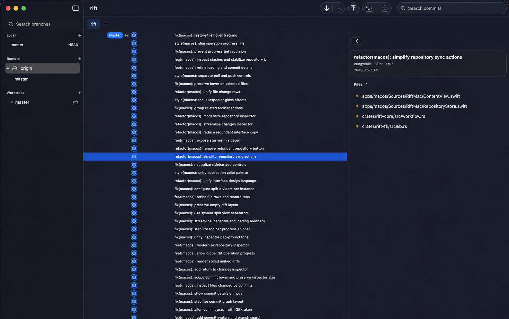

<div align="center">
  
  <h1>Rift</h1>
  <p><strong>Native throughout.</strong></p>
  <p>Liquid Glass. Small footprint. Native speed.</p>
  <p><a href="https://github.com/eungyeole/rift/releases/download/nightly/Rift-macOS.dmg">Download for macOS</a> · <a href="https://rift.eungyeole.com/">Website</a> · <a href="https://github.com/eungyeole/rift/releases">Releases</a></p>
</div>

<br>



## Less app. More Mac.

Rift is a focused Git client built with SwiftUI, AppKit, and a Rust core. It uses native macOS controls and materials instead of shipping a browser runtime, so it feels at home, starts quickly, and stays compact.

- **Liquid Glass** — system materials, controls, menus, and window behavior.
- **Small footprint** — a native interface with no bundled browser.
- **Native speed** — responsive system UI backed by a fast shared Git engine.

## A complete Git workspace

History, branches, worktrees, stashes, changes, and diffs live in one window. Rift supports everyday Git work including staging individual files or hunks, commits, fetch, pull, push, merge, rebase, cherry-pick, conflict resolution, remotes, tags, worktrees, and submodules.

Repository tabs return after relaunch. Commit and stash inspection share the same file and diff experience. Existing Git credentials, SSH configuration, hooks, filters, and global settings continue to work through the installed `git` executable.

> Rift currently focuses on macOS 26. The native Windows client is planned for a later release.

## Build

Requires macOS 26+, Xcode 26 with Swift 6.2, stable Rust, and Git on `PATH`.

```sh
cargo build -p rift-ffi --release
swift run --package-path apps/macos RiftMac
```

Create an ad-hoc signed app bundle and DMG:

```sh
./scripts/package-macos.sh
```

The packaged preview is not notarized. On first launch, Control-click Rift in Finder and choose **Open**.

## Project

```text
apps/macos        SwiftUI + AppKit app
apps/windows      WinUI preview
crates/rift-core  Git models and workflows
crates/rift-ffi   Native C boundary
crates/rift-cli   Development CLI
docs              Product site
```

The Rust engine owns Git behavior while each platform keeps its own native interface. See [macOS notes](apps/macos/README.md), [Windows status](apps/windows/README.md), or [product direction](docs/PRODUCT.md) for more detail.

<details>
<summary>Development checks</summary>

```sh
cargo test --workspace
cargo clippy --workspace --all-targets -- -D warnings
```

Pushes to `master` refresh the rolling nightly release. The macOS app checks its signed Sparkle feed daily and also exposes **Rift → Check for Updates…**.

</details>

## Contributing

Issues and focused pull requests are welcome. Rift is available under the MIT license.
